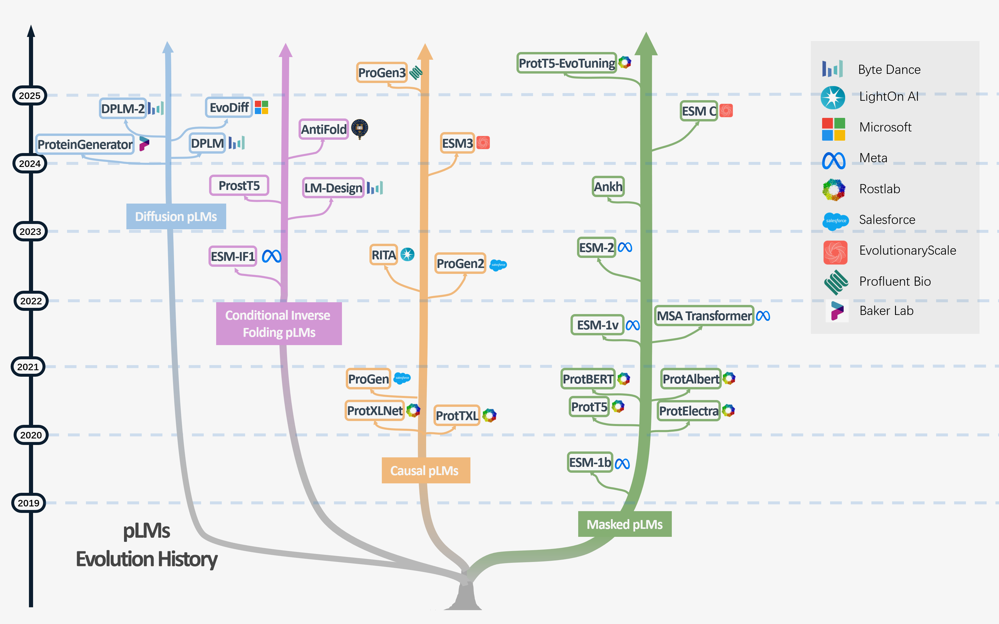

# A Survey on Efficient Protein Language Models

[](https://openreview.net/forum?id=PTReuOwsXz)
[](https://openreview.net/forum?id=PTReuOwsXz)
[](./A_Survey_on_Efficient_Protein_Language_Models.pdf)
[](./LICENSE)

This repository is the companion resource hub for our survey **“A Survey on Efficient Protein Language Models”**, published in *Transactions on Machine Learning Research* (TMLR), 2026. It collects the survey figures, a curated reading list of the key papers we review, and versioned releases of the survey itself. **The repository is actively maintained — updated versions of the survey will be posted here.**

> 📄 **Paper:** [A_Survey_on_Efficient_Protein_Language_Models.pdf](./A_Survey_on_Efficient_Protein_Language_Models.pdf) &nbsp;·&nbsp; **OpenReview:** https://openreview.net/forum?id=PTReuOwsXz

## Authors

**Shouren Wang**<sup>1</sup> · **Debargha Ganguly**<sup>1</sup> · **Vinooth Rao Kulkarni**<sup>1</sup> · **Wang Yang**<sup>1</sup> · **Zhuoran Qiao**<sup>2</sup> · **Daniel Blankenberg**<sup>3</sup> · **Vipin Chaudhary**<sup>1</sup> · **Xiaotian Han**<sup>1</sup>

<sup>1</sup> Case Western Reserve University &nbsp;·&nbsp; <sup>2</sup> Chai Discovery &nbsp;·&nbsp; <sup>3</sup> Cleveland Clinic

📧 Contact &amp; repository maintainer: **Shouren Wang** ([sxw992@case.edu](mailto:sxw992@case.edu))

<p align="center">
  
  <br>
  <em>The evolution history of protein language models (pLMs), 2019–2025, across the Masked, Causal, and Conditional-Inverse-Folding families.</em>
</p>

## Abstract

Protein language models (pLMs) have become indispensable tools in computational biology, driving advances in variant effect prediction, functional annotation, structure prediction, and engineering. However, their rapid expansion from millions to tens of billions of parameters introduces significant computational, accessibility, and sustainability challenges that limit practical application in environments constrained by GPU memory, hardware availability, and energy budgets. This survey presents the **first comprehensive review of efficient pLMs**, synthesizing recent advances across four key dimensions: **(1) dataset efficiency**, **(2) architecture efficiency**, **(3) training efficiency**, and **(4) inference efficiency**. We additionally trace the historical evolution of pLMs, analyze intersections across efficiency dimensions, identify evaluation-comparability challenges, discuss LLM techniques not yet explored for pLMs, and offer practical recommendations for selecting efficiency strategies.

## Taxonomy of Efficient pLMs

The survey is organized around four efficiency dimensions plus background, discussion, and future directions:

| § | Dimension | Topics | Figure |
|---|-----------|--------|--------|
| 1 | **Introduction & Background** | Evolution and applications of pLMs; Masked vs. Causal pLMs | [`pLMs_history_tree`](./figures/pLMs_history_tree.png), [`CpLM_vs_MpLM`](./figures/CpLM_vs_MpLM.png) |
| 2 | **Dataset Efficiency** | Meta-learning-based few-shot; scaling-law-guided data allocation | [`efficient_datasets`](./figures/efficient_datasets.png) |
| 3 | **Architecture Efficiency** | Efficient/quantized transformers; embedding compression; convolution-based designs | [`efficient_architectures`](./figures/efficient_architectures.png) |
| 4 | **Training Efficiency** | Scaling-law-informed pretraining; structure-integrated multimodal training; low-rank fine-tuning; distillation | [`efficient_pretraining`](./figures/efficient_pretraining.png), [`efficient_tuning`](./figures/efficient_tuning.png) |
| 5 | **Inference Efficiency** | Quantization; dense retrieval; structure search | [`efficient_inference`](./figures/efficient_inference.png) |
| 6 | **Discussion** | Intersections across efficiency dimensions; evaluation benchmarks & comparability | — |
| 7 | **Future Directions** | Near-term emerging LLM techniques for pLMs; longer-term quantum computing | [`quantum_computing`](./figures/quantum_computing.png) |
| 8 | **Conclusion** | Practical guidance for next-generation pLMs | — |

## Curated Reading List

Key works reviewed in the survey, grouped by efficiency dimension. See [`papers.md`](./papers.md) for the full list with links.

### 1 · Dataset Efficiency
- **FSFP** — Enhancing efficiency of pLMs with minimal wet-lab data through few-shot learning
- **Expert-guided pLMs** — accurate and blazingly fast fitness prediction (*Bioinformatics*)
- **Compute-optimal pLMs** — Training compute-optimal protein language models (scaling laws)

### 2 · Architecture Efficiency
- **Convolutions are competitive with transformers** for protein sequence pretraining
- **Embedding compression** — Tokenized and continuous embedding compressions of protein sequence and structure
- **2 Bits of Protein** — efficient (quantized) protein representation
- **Post-Training Quantization** — Exploring post-training quantization of protein language models

### 3 · Training Efficiency
- **Cramming** — Cramming protein language model training in 24 GPU hours
- **ProstT5** — Bilingual language model for protein sequence and structure (multimodal)
- **SES-Adapter** — A simple, efficient, and scalable structure-aware adapter that boosts pLMs
- **Fine-tuning pLMs** boosts predictions across diverse tasks
- **Assessing Quantization and Efficient Fine-Tuning** for protein language models
- **Multi-teacher distillation** — Accurate and efficient protein embedding via multi-teacher distillation
- **AlphaFold3 cross-distillation** — using AlphaFold2 as a teacher
- **ProtGO** — function-guided protein modeling for unified representation learning

### 4 · Inference Efficiency
- **PLMSearch** — pLM powers accurate and fast sequence search for remote homology
- **Deep dense retrieval** — Fast, sensitive detection of protein homologs
- **RAG-ESM** — Improving pretrained pLMs via sequence retrieval

## Repository Structure

```
.
├── A_Survey_on_Efficient_Protein_Language_Models.pdf   # latest manuscript
├── figures/            # all survey figures (taxonomy, history tree, per-dimension overviews)
├── papers.md           # curated reading list of reviewed papers (with links)
├── survey-releases/    # versioned snapshots of the survey (e.g., v1_TMLR_202606.pdf)
├── LICENSE
└── README.md
```

## Releases

| Version | Date | Venue | File |
|---------|------|-------|------|
| v1 | 2026-06 | TMLR | [`survey-releases/v1_TMLR_202606.pdf`](./survey-releases/v1_TMLR_202606.pdf) |

Future revisions and extended versions will be added to [`survey-releases/`](./survey-releases).

## Citation

If you find this survey useful, please cite:

```bibtex
@article{wang2026efficientplm,
  title   = {A Survey on Efficient Protein Language Models},
  author  = {Wang, Shouren and Ganguly, Debargha and Kulkarni, Vinooth Rao and Yang, Wang and Qiao, Zhuoran and Blankenberg, Daniel and Chaudhary, Vipin and Han, Xiaotian},
  journal = {Transactions on Machine Learning Research},
  year    = {2026},
  url     = {https://openreview.net/forum?id=PTReuOwsXz}
}
```

## Contributing

Suggestions for papers we may have missed are welcome — please open an issue or pull request. As the field of efficient pLMs evolves rapidly, we intend to keep both the reading list and the survey itself up to date.

## License

See [LICENSE](./LICENSE). Figures and text from the survey are © the authors. The reviewed third-party papers are linked (not redistributed) in [`papers.md`](./papers.md) and remain under their respective publishers' copyright.
